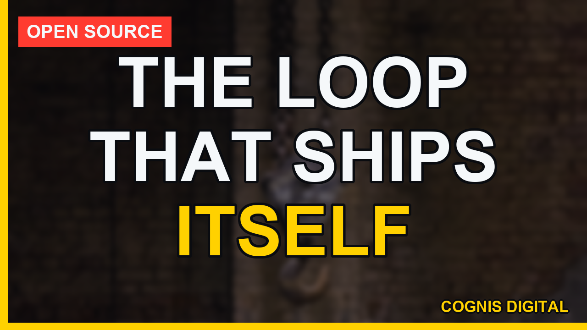
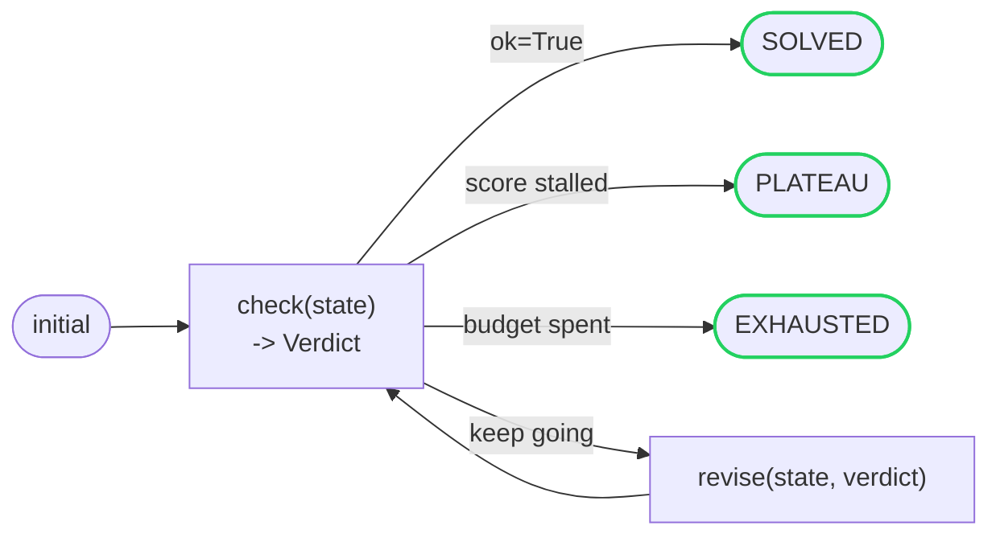

# cyclework

[](https://github.com/cognis-digital/cyclework/actions/workflows/ci.yml)

> Part of the **[Accountable AI Engineering suite](https://github.com/cognis-digital/accountable-ai-suite)** — provable governance for AI agents on infrastructure you own.

**A tiny, dependency-free engine for iterative refinement loops: propose → check → revise → repeat.**

Ask yourself:

- Is your agent's "keep trying until it's right" logic a **`while` loop nobody can inspect** afterward?
- When a refinement loop stops, can you tell whether it **solved**, **gave up**, or just **stopped improving** — and see every step it took?
- Are you re-implementing the same propose → check → revise scaffolding in every project?

A lot of useful work has that one shape: produce a candidate, check it against a goal, use the feedback to produce a better one — until it's good enough, it stops improving, or you run out of budget. Solvers, optimizers, retry-with-feedback agent loops, and self-correcting generators are all *this loop*.

`cyclework` makes it a first-class, inspectable object instead of a `while` buried in a function. You supply two functions — how to **check** a candidate and how to **revise** it given feedback — and the engine runs the cycle, detects convergence and plateaus, enforces a budget, captures errors, and hands back a full trace.

- **Domain-agnostic.** The candidate ("state") can be a number, a string, a dict, an AST — anything.
- **Inspectable.** Every iteration is recorded; you get the answer *and* the path to it.
- **Honest stopping.** Solved, plateaued, or exhausted — the result tells you which, with the best candidate it saw.
- **Zero dependencies.** Pure Python standard library, ~150 lines of engine.


## Watch the walkthrough

A full narrated tour — setup, the tool in action, and every demo scenario:

[](https://github.com/cognis-digital/cyclework/releases/download/walkthrough-v1/walkthrough.mp4)

▶ **[Watch the walkthrough (MP4)](https://github.com/cognis-digital/cyclework/releases/download/walkthrough-v1/walkthrough.mp4)**

## Install

```bash
pip install -e .          # or vendor the cyclework/ package directly
```

## The whole API in one example

```python
from cyclework import Engine, Verdict

# Goal: refine an integer up to 5.
engine = Engine(
    check=lambda s: Verdict(ok=s >= 5, score=float(s)),   # how good is this candidate?
    revise=lambda s, verdict: s + 1,                       # produce a better one
    max_iterations=10,
)

result = engine.run(0)
print(result.summary())
# {'status': 'solved', 'iterations': 6, 'solved': True, 'final_score': 5.0, ...}
```

### A real solver

```python
from cyclework.examples import sqrt_newton

res = sqrt_newton(2.0)        # Newton's method, expressed as a refinement loop
print(res.state)              # 1.4142135623730951
print(res.iterations)         # ~6 (Newton doubles precision each step)
```

### Feedback-driven revision

The verdict can carry `feedback` that steers the next revision — the basis of any retry-with-feedback or self-correcting loop:

```python
from cyclework.examples import refine_slug

refine_slug("  Hello,  World!!  ").state   # -> "hello-world"
```

Each cycle, `check` reports the first rule the candidate breaks; `revise` applies exactly that fix; the loop converges when nothing is broken.

## How the loop runs



See [`docs/ARCHITECTURE.md`](docs/ARCHITECTURE.md) for the full picture (data
model, stopping conditions, and why the loop is a first-class object).

## Concepts

| Piece | Role |
|-------|------|
| **`check(state) -> Verdict`** | Scores a candidate. `Verdict.ok` decides whether to stop; `Verdict.score` (higher is better) drives convergence and best-tracking; `Verdict.feedback` is handed to the next revise. |
| **`revise(state, verdict) -> state`** | Produces the next candidate, optionally using the verdict's feedback. |
| **`seed(initial) -> state`** *(optional)* | A one-time preprocess of the starting candidate. |
| **`Engine.run(initial) -> Result`** | Runs the loop to completion. |
| **`Engine.cycle(initial)`** | Generator form: yields each `Iteration` as it happens, for streaming/observability. |
| **`Result`** | `status` (`solved` / `plateau` / `exhausted` / `error`), final `state`, `history`, `best`, and `error`. |

### Stopping conditions

- **Solved** — a verdict comes back `ok=True`.
- **Plateau** — with `patience=N` set, the score fails to improve by at least `min_delta` for `N` consecutive checks. (Higher-is-better; negate a cost to minimize it.)
- **Exhausted** — `max_iterations` reached without solving.
- **Error** — a `check`/`revise` raised; the run aborts cleanly with the trace so far.

### Observability

Pass `on_iteration=callback` to receive every `Iteration` as it's recorded — wire it to a logger, a progress bar, or an audit sink.

```python
Engine(check, revise, on_iteration=lambda it: print(it.index, it.score))
```

## Demos

Five runnable, narrated scenarios in [`demos/`](demos/), each for a different
audience — all driving the real API, no network, exit 0. Full descriptions in
[`docs/DEMOS.md`](docs/DEMOS.md).

```bash
python demos/run_all.py               # all five, end to end
python demos/02_numeric_solvers.py    # or just one
```

| # | Demo | Audience | Shows |
|---|------|----------|-------|
| 1 | [`01_agent_retry_loop.py`](demos/01_agent_retry_loop.py) | AI / LLM agent builders | A self-correcting "fix until tests pass" loop, made inspectable: the full trace is the audit trail. |
| 2 | [`02_numeric_solvers.py`](demos/02_numeric_solvers.py) | Numerical engineers | Convergence as a loop — Newton's sqrt, a `cos(x)` fixed point, a geometric series. |
| 3 | [`03_plateau_and_budget.py`](demos/03_plateau_and_budget.py) | Production loop owners | Honest stopping: SOLVED / PLATEAU / EXHAUSTED / ERROR, always keeping the best candidate. |
| 4 | [`04_feedback_refiner.py`](demos/04_feedback_refiner.py) | Pipeline engineers | Feedback-driven revision: the verdict names the fix, revise applies exactly it. |
| 5 | [`05_streaming_observability.py`](demos/05_streaming_observability.py) | Observability engineers | Watching a loop live via `on_iteration` and the `Engine.cycle()` generator. |

On a cp1252 (Windows) console, prefix with `PYTHONUTF8=1`.

## Testing

```bash
pip install -e ".[dev]"
pytest -q          # 24 tests (engine, examples, and demo smoke tests)
```

## License

COCL (Cognis Open Collaboration License). © Cognis Digital.

> Status: v0.1 — runnable and tested. Roadmap: async stages, parallel candidate fan-out (keep-best-of-N per cycle), and built-in budget accounting (token/time cost per iteration).
