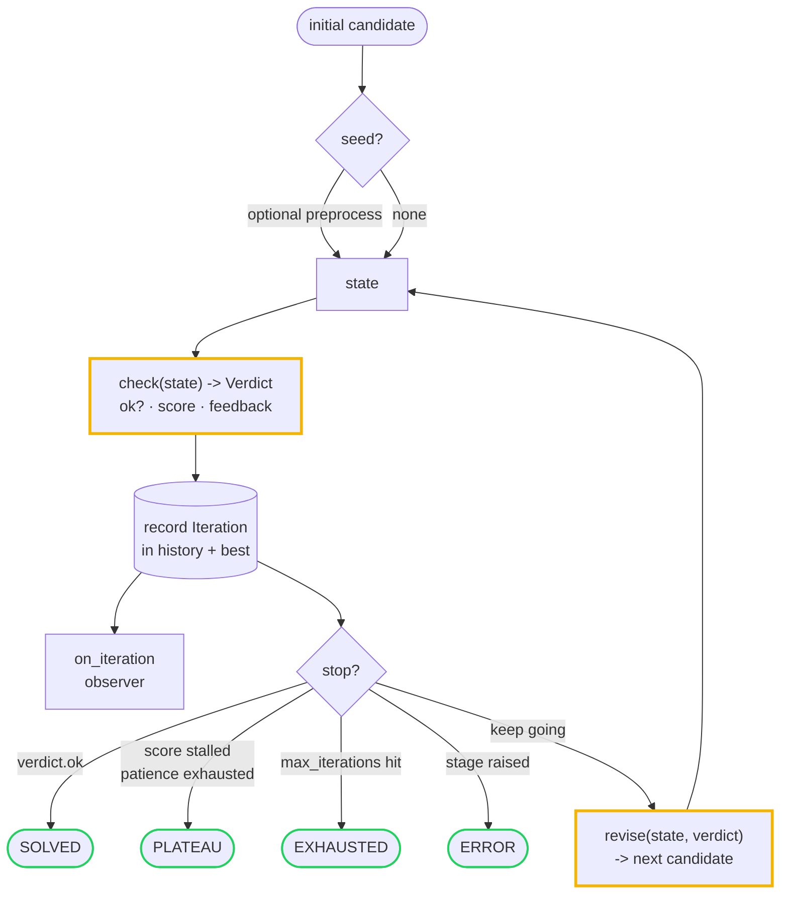
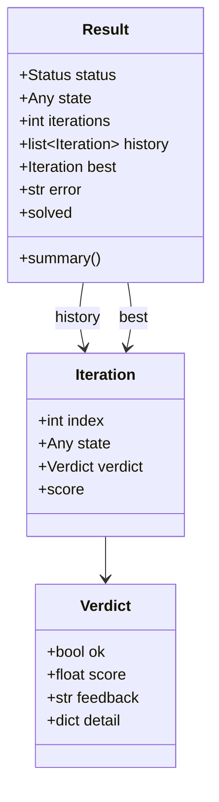

# Architecture

`cyclework` is a tiny engine for **iterative refinement loops**: produce a
candidate, check it against a goal, use the feedback to produce a better one,
repeat until it's good enough, stops improving, or you run out of budget. This
document explains how the few pieces fit together.

The whole library is ~150 lines of pure standard-library Python across four
modules. There is no runtime dependency, no I/O, and no global state.

## The loop

You supply two functions — `check` (how good is this candidate?) and `revise`
(produce a better one) — and the engine runs the cycle, recording every step.

The only thing the engine knows about your problem is the `Verdict` your `check`
returns. Everything domain-specific lives in your two functions; everything
about *running and explaining the loop* lives in the engine.

## Components

### `Verdict` (`cyclework/verdict.py`)
The result of checking one candidate. Three fields answer three questions:

- `ok` — is this good enough to stop? *(the only required field)*
- `score` — an optional quality number, **higher is better**; drives plateau
  detection and best-candidate tracking. Negate a cost to minimize it.
- `feedback` (+ free-form `detail`) — information handed to the next `revise`
  step: an error message, a diff, a gradient hint, the name of the next fix.

Keeping the verdict separate from the revise step lets the engine reason about
progress (via `score`) without knowing anything about the problem domain.
`Verdict.passed(...)` / `Verdict.failed(...)` are convenience constructors.

### `Engine` (`cyclework/engine.py`)
The refinement engine. Constructed with `check`, `revise`, and optional knobs:

| Knob | Effect |
|------|--------|
| `max_iterations` | hard budget; the only required stop |
| `patience` / `min_delta` | plateau detection: stop after `patience` checks with no score gain of at least `min_delta` |
| `seed` | one-time preprocess of the initial candidate |
| `on_iteration` | observer callback, fired with every recorded `Iteration` |

It exposes two forms of the same loop:

- **`run(initial) -> Result`** — runs to completion and returns the full outcome.
- **`cycle(initial)`** — a generator that yields each `Iteration` as it happens,
  so the caller can stream, throttle, or stop early from the outside.

A stage (`check` or `revise`) that raises does not crash the caller: the run
aborts cleanly with `Status.ERROR` and the trace collected so far.

### `Iteration` and `Result` (`cyclework/trace.py`)
The inspectable history. Every step is an `Iteration` (its `index`, the
`state`, and the `verdict`). A `Result` bundles the terminal `status`, the final
`state`, the complete `history`, the highest-scoring `best` iteration, and any
`error`. `Result.summary()` returns an at-a-glance dict for logs and dashboards.

### `Status` (`cyclework/trace.py`)
The four terminal states a run can reach — and the whole point of making the
loop a first-class object is that you can tell them apart:

- **`SOLVED`** — a verdict came back `ok=True`.
- **`PLATEAU`** — the score stopped improving (patience exhausted).
- **`EXHAUSTED`** — `max_iterations` reached without solving.
- **`ERROR`** — a stage raised; the run aborted with the trace so far.

### `examples` (`cyclework/examples.py`)
Worked uses of the engine, each exercised by the tests: `sqrt_newton` (a numeric
solver), `fixed_point` (generic successive approximation), and `refine_slug` (a
feedback-driven text refiner where the verdict actively steers the next fix).

## Why these choices

- **Two functions, one engine.** Solvers, optimizers, retry-with-feedback agent
  loops, and self-correcting generators are all the same loop. cyclework is the
  loop; the domain lives in `check`/`revise`.
- **Inspectable by construction.** The trace is not a feature bolted on — every
  iteration is recorded on the path the loop already takes, so you get the
  answer *and* the path to it.
- **Honest stopping.** "It finished" is never enough; the `Status` tells you
  *why* it finished, and `best` is always there to fall back on.
- **Zero dependencies, no I/O.** The engine never touches the network or disk.
  It is safe to embed anywhere and trivial to test.
